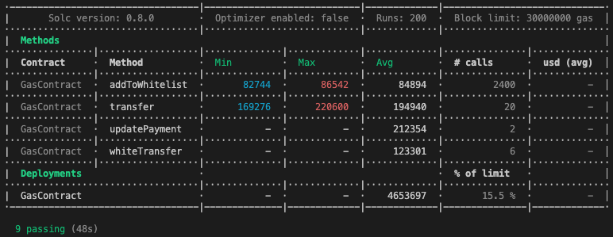

# Session 12, Project-ETHDenver-bootcamp
3 November 2022
# Zoom session
* 105 attendants, gas optimization
  * optimization on storage, memory, calldata
  * optimization on use of data types bytes32, bytes, packing data
  * optimization on variables
  * optimization on compiled function ordering, first functions in the compiled list ordered by ID cost less
  * optimization on loops
  * optimization on deployment costs or on runtime costs, use of Remix,
  * optimization on use of customized errors, on use of events instead of storage
  * measuring tool giving a table of gas costs per function inside contract sol2UML, see https://medium.com/@kccmeky/how-to-create-uml-class-diagram-from-your-solidity-contract-6bc050016da8
* The zoom recording of 3rd November: https://youtu.be/GKwEYAU-FWQ
* Session 12 useful links:
    - https://docs.soliditylang.org/en/v0.8.17/internals/optimizer.html: Solidity optimizer docs
    - https://www.youtube.com/watch?v=ngxWWS3Qr3Q: video explaining ERC 1155
    - https://tenderly.co/: like Remix with more development tools
    - https://github.com/naddison36/sol2uml: repository of sol2UML
    - https://blog.openzeppelin.com/compound-gas-optimizations-audit/: example of Open Zeppelin optimization audit report for Compound
    - https://www.linkedin.com/pulse/solidity-gas-optimisation-tips-chibuike-onwubiko/: best practices in optimizations

# Homework
## Assignment: Team Gas Optimization Game
Follow the README instructions for the gas optimisation team game in the repo https://gitpod.io/#https://github.com/ExtropyIO/SolidityBootcamp, that leads to https://extropyio-soliditybootc-n69te8ipo08.ws-eu73.gitpod.io/. 

- Note that going directly to the latter link will fail with the message "*operation not permitted: missing get permission on workspace*". You have to use the first link.

These are in the `Exercises/Gas` directory.
Your team should try to reduce the amount of gas used to deploy the contract, and when running transactions.
You can change the code as much as you like, but you must not change the tests, and your contract must pass all tests.

### What is gitpod?
See https://stackoverflow.com/questions/63588658/what-is-gitpod-what-does-it-actually-do.

*Gitpod = server-side-dev-envs + dev-env-as-code + prebuilds + IDE + collaboration.*

1.	From a Git Repository on GitHub, Gitlab or Bitbucket, Gitpod can spin up a serve*r-side-dev-environment for you in seconds. That's a docker container that you can fully customize and that includes your source code, git-Terminal, VS Code extensions, your IDE (Theia IDE), etc. The dev environment is enough powerful to run your app and even side-services like databases.*
*2.	Step (1) is easily repeatable and reproducible because it's automated and version-controlled and shared across the team. We call this dev-environment-as-code. Think of infrastructure-as-code for your dev environment.*
*3.	After (1), you're immediately ready-to-code, because your workplace is already compiled and all dependencies of your code have been downloaded. Gitpod does that by running your build tools on git-push (like CI/CD would do) and "prebuilds" and store your workspace until you need it. This really shines when reviewing PRs in Gitpod.*
*4.	Collaboration becomes much easier once your dev environments live server-side and your IDE runs in the browser. Sending a snapshot of your dev environment to a colleague is as easy as sending a URL. The same goes for live shared coding in the same IDE and dev-environments.*

*At the end of the day, you start treating your dev environments as something ephemeral: You start them, you code, your push your code, and you forget your dev environment. For your next thing, you'll use a fresh dev environment.
The ease of mind that you get from not messing, massaging, and maintaining dev environments on your local machine is incredibly liberating.*

*Gitpod can be used on gitpod.io, or self-hosted on Kubernetes, GCP, or AWS.*

### Assignment README
The README.md says: **Optimisation Game Instructions**
1.	Open a terminal go to the Gas directory
2.	Run `npm i` to install the dependencies
3.	Run `npx hardhat test` to run the tests and get a gas usage report



If you prefer to use a different IDE, you may, but you will need to make sure the contract passes the same tests.
The aim of the game is to reduce the Average figures for contract deployment and transfer and updatePayment functions as much as possible.
You can change the contract as much as you like. You cannot change the tests, and all the tests must pass.
In order to generate storage diagram, run the following command:

```sh
> sol2uml storage ./contracts/ -c GasContract -o gasStorage.svg
```
Useful links:
- https://github.com/ExtropyIO/SolidityBootcamp/tree/main/Exercises/Gas: actual exercise code to optimize
- measuring tool giving a table of gas costs per function inside contract sol2UML, see https://medium.com/@kccmeky/how-to-create-uml-class-diagram-from-your-solidity-contract-6bc050016da8
- github of Sol2UML tool: https://github.com/naddison36/sol2uml

## Solution 
### Preparation
As told in README.md, every time Gitpod starts a new environment I move to the folder Exercises/Gas and install the dependencies:
```sh
gitpod /workspace/SolidityBootcamp/Exercises/Gas (main) $ npm -version
8.19.2 
gitpod /workspace/SolidityBootcamp (main) $ cd Exercises/Gas
gitpod /workspace/SolidityBootcamp/Exercises/Gas (main) $ npm i
npm WARN deprecated ganache-core@2.13.2: ganache-core is now ganache; visit https://trfl.io/g7 for details
npm WARN deprecated ganache-core@2.13.2: ganache-core is now ganache; visit https://trfl.io/g7 for details
npm WARN deprecated testrpc@0.0.1: testrpc has been renamed to ganache-cli, please use this package from now on.
npm WARN deprecated request-promise-native@1.0.9: request-promise-native has been deprecated because it extends the now deprecated request package, see https://github.com/request/request/issues/3142
npm WARN deprecated querystring@0.2.0: The querystring API is considered Legacy. new code should use the URLSearchParams API instead.
npm WARN deprecated request@2.88.2: request has been deprecated, see https://github.com/request/request/issues/3142
npm WARN deprecated har-validator@5.1.5: this library is no longer supported
npm WARN deprecated uuid@3.4.0: Please upgrade  to version 7 or higher.  Older versions may use Math.random() in certain circumstances, which is known to be problematic.  See https://v8.dev/blog/math-random for details.
npm WARN deprecated uuid@2.0.1: Please upgrade  to version 7 or higher.  Older versions may use Math.random() in certain circumstances, which is known to be problematic.  See https://v8.dev/blog/math-random for details.
npm WARN deprecated debug@3.2.6: Debug versions >=3.2.0 <3.2.7 || >=4 <4.3.1 have a low-severity ReDos regression when used in a Node.js environment. It is recommended you upgrade to 3.2.7 or 4.3.1. (https://github.com/visionmedia/debug/issues/797)
npm WARN deprecated @ensdomains/ens@0.4.5: Please use @ensdomains/ens-contracts
npm WARN deprecated @ensdomains/resolver@0.2.4: Please use @ensdomains/ens-contracts

added 1647 packages, and audited 1651 packages in 36s

168 packages are looking for funding
  run `npm fund` for details

57 vulnerabilities (4 low, 13 moderate, 16 high, 24 critical)

To address issues that do not require attention, run:
  npm audit fix

Some issues need review, and may require choosing
a different dependency.

Run `npm audit` for details.
npm notice 
npm notice New patch version of npm available! 8.19.2 -> 8.19.3
npm notice Changelog: https://github.com/npm/cli/releases/tag/v8.19.3
npm notice Run npm install -g npm@8.19.3 to update!
```

Then I run the tests
```sh
gitpod /workspace/SolidityBootcamp/Exercises/Gas (main) $ npx hardhat test
Downloading compiler 0.8.0
Compiled 2 Solidity files successfully

  Gas1
    ✓ Check that admins have been added
    ✓ Checks that the total supply is 10000
    ✓ Checks a transfer
    ✓ Checks an update
    ✓ Checks for events
    ✓ Checks for admin
    ✓ Ensure trading mode is set
    ✓ Add users to whitelist and validate key users are added with correct tier
    ✓ Whitelist transfer works
```
**(table to be formatted)**

| -------------------------------- | -------------------------- | ----------- | --------------------------- |
|       Solc version: 0.8.0        |  Optimizer enabled: false  |  Runs: 200  |  Block limit: 30000000 gas  │
|··································|····························|·············|·····························|
|  Methods                                                                                                  │
|··································|····························|·············|·····························|
|  Contract     |  Method          |  Min         |  Max        |  Avg        |  # calls      |  usd (avg)  │
|··································|····························|·············|·····························|
|  GasContract  |  addToWhitelist  |       82756  |      86542  |      84894  |         2400  |          -  │
|··································|····························|·············|·····························|
|  GasContract  ·  transfer        ·      169276  ·     220600  ·     194940  ·           20  ·          -  │
|··································|····························|·············|·····························|
|  GasContract  ·  updatePayment   ·           -  ·          -  ·     212354  ·            2  ·          -  │
|··································|····························|·············|·····························|
|  GasContract  ·  whiteTransfer   ·      123289  ·     123301  ·     123297  ·            6  ·          -  │
|··································|····························|·············|·····························|
|  Deployments                     ·                                          ·  % of limit   ·             │
|··································|····························|·············|·····························|
|  GasContract                     ·           -  ·          -  ·    4653697  ·       15.5 %  ·          -  │
|----------------------------------|----------------------------|-------------|-----------------------------|

```sh
  9 passing (35s)
Note that all the gas costs are like in the example screen except for the function whiteTransfer.
```
### Unusual optimization technique
To comply strictly with the rules of the game, a bootcamp participant simply stripped off all the code that do not contribute directly to satisfy the tests. This gives a smart contract that isn't of much use but all the tests pass, which is the rule of the game 🙂.

This highlights a very good approach when programming Solidity: (1) code the tests that are representative of the usefulness of the contract (2) code only in Solidity the strict minimum to pass the tests.

#### Usual optimization techniques
See https://www.alchemy.com/overviews/solidity-gas-optimization.

-	use mappings instead of arrays: Except where iteration is required or data types can be packed, it is advised to use mappings to manage lists of data in order to conserve gas. This is beneficial for both memory and storage. An integer index can be used as a key in a mapping to control an ordered list. Another advantage of mappings is that you can access any value without having to iterate through an array as would otherwise be necessary.
- minimize On-Chain Data
- batching operations : batching operations enables developers to batch actions by passing dynamically sized arrays that can execute the same functionality in a single transaction, rather than requiring the same method several times with different values. Like this code
```js
function batchSend(Call[] memory _calls) public payable {
       for(uint256 i = 0; i < _calls.length; i++) {
           (bool _success, bytes memory _data) = _calls[i].recipient.call{gas: _calls[i].gas, value: _calls[i].value}(_calls[i].data);
           if (!_success) {
              
               assembly { revert(add(0x20, _data), mload(_data)) }
           }
       }
   }
```
the user would only need to pay the transaction's fixed gas cost and the gas for the msg.sender check once.

- Avoid looping to iterate when not needed: avoid looping through lengthy arrays; not only will it consume a lot of gas, but if gas prices rise too much, it can even prevent your contract from being carried out beyond the block gas limit. Instead of looping over an array until you locate the key you need, use mappings, which are hash tables that enable you to retrieve any value using its key in a single action.
- Use Indexed Events: use indexed events instead of storage to save values that are not needed anymore after the smart contract executes
- Use uint8 wisely: Smaller-size unsigned integers, such as uint8, are only more effective when multiple variables can be stored in the same storage space, like in structs. uint256 uses less gas than uint8 in loops and other situations.
- Pack Your Variables
- Store Data in `calldata` instead of `memory`: instead of copying variables to memory, it is typically more cost-effective to load them immediately from `calldata`. If all you need to do is read data, you can conserve gas by saving the data in `calldata`.
- Use `immutable` and `constant`: constant variables cannot be changed after being compiled, whereas immutable variables can be set within the constructor.
- Use the `external` Visibility Modifier: because the `public` visibility modifier is equivalent to using the `external` and `internal` visibility modifier

Only arrays, struct and mapping can be `calldata` so the arguments are OK.

#### Optimize function `transfer`
Avoid initializing variables to 0 that is already the default value.
- Try with `basicFlag` in contract Constant: `GasContract` goes from 4653697 to 4651423, minus 2274.
- Do the same for `totalSupply`, `paymentCounter`, `tradeMode`, `isReady`: `GasContractv goes from 4651423 to 4644038, minus 7385. But we can't initialize by default `defaultPayment` to `Unknown` because `defaultPayment` is a constant and must be initialized explicitly.

Index events
- declare indexed the addresses, the `transferID`, the recipient name in events `AddedToWhitelist`, `Transfer`, `PaymentUpdated`, `WhiteListTransfer`: `GasContract` goes from 4644038 to 4661767, increased 17729. But `addToWhitelist` goes from 84894 to 84837, minus 57 (x 2400 = 136'800), `transfer` goes from 194940 to 194919, minus 21 (x 20 = 420), etc.

####	Optimize function `updatePayment`

Optimize arguments
- move to calldata the arguments `_user`, `_ID, `_amount`, `_type`: this is not correct because `memory` and `calldata` can only be specified for arrays, structs and mappings.


... ***To be continued*** 