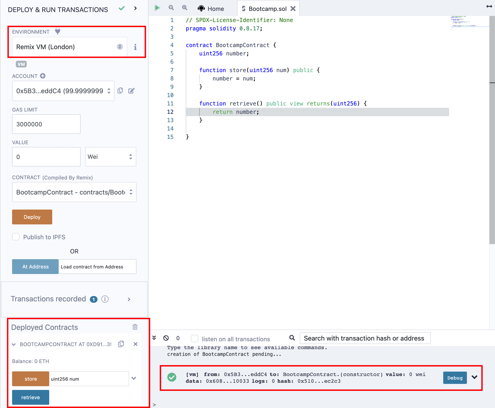
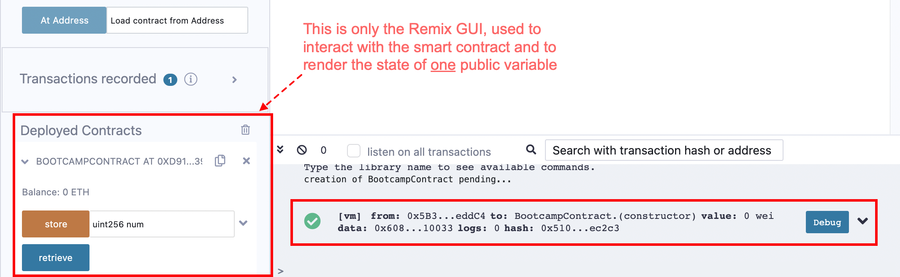

# Session 2, Project-ETHDenver-bootcamp
18 October 2022
# Zoom session

* 157 attendants
* PoW, PoS, consensus engine, execution engine
* The Merge, slots every 12s, epoch is 21 slots, at each slot one validator is chosen at random to build a block, aggregators are used to lessen the traffic of validators
* A slot can be empty if the chosen validator doesn't propose a block. In average 0.5% of slots are empty since the Merge
* First block of an epoch is a checkpoint block. Finalization of transactions of each epoch is reached when last block of next epoch is validated
* Use of Etherscan
* Use of Remix
* Solidity syntax

* Course materials: https://discord.com/channels/705799923014041651/1029362428514938990/1031984998754029609
* Recording of the Zoom session: https://www.youtube.com/watch?v=ta5sTeJuNJk
* Useful links
  https://remix.ethereum.org/
  https://solidity-by-example.org/
  https://sandbox.tenderly.co/
  https://medium.com/codechain/modified-merkle-patricia-trie-how-ethereum-saves-a-state-e6d7555078dd
  https://ethereum.org/en/run-a-node/
# Homework
## Assignment

1. Using a blockchain explorer, have a look at the following transactions, what do they do ?
  ```
	1. 0x0ec3f2488a93839524add10ea229e773f6bc891b4eb4794c3337d4495263790b
	2. 0x4fc1580e7f66c58b7c26881cce0aab9c3509afe6e507527f30566fbf8039bcd0
	3. 0x552bc0322d78c5648c5efa21d2daa2d0f14901ad4b15531f1ab5bbe5674de34f
	4. 0x7a026bf79b36580bf7ef174711a3de823ff3c93c65304c3acc0323c77d62d0ed
	5. 0x814e6a21c8eb34b62a05c1d0b14ee932873c62ef3c8575dc49bcf12004714eda
  ```

2. What is the largest account balance you can find ?

3. What is special about these accounts :
  ```
	1. 0x1db3439a222c519ab44bb1144fc28167b4fa6ee6
	2. 0x000000000000000000000000000000000000dEaD
  ```
4. Using [remix](https://remix.ethereum.org)  add [this](https://gist.github.com/extropyCoder/77487267da199320fb9c852cfde70fb1) contract as a source file 
   	1. Compile the contract
   	2. Deploy the contract to the Remix VM environment

## Solution
_**What do these transactions do?**_
  ```
	1. 0x0ec3f2488a93839524add10ea229e773f6bc891b4eb4794c3337d4495263790b
  ```
Transaction was done on Jun-17-2016 03:34:48 AM +UTC. It created the famous "The DAO". 
  ```
	2. 0x4fc1580e7f66c58b7c26881cce0aab9c3509afe6e507527f30566fbf8039bcd0
  ```
Transaction created the famous "Uniswap V2", name is " UniswapV2Router02", compiler version is v0.6.6+commit.6c089d02. The source code is at https://etherscan.io/address/0x7a250d5630b4cf539739df2c5dacb4c659f2488d 
  ```
	3. 0x552bc0322d78c5648c5efa21d2daa2d0f14901ad4b15531f1ab5bbe5674de34f
  ```
Transaction was done on Aug-10-2021 04:05:47 PM +UTC. It was a hack of PolyNetwork BTC to ETH bridge, where USD 610M were stolen. See twitter: https://twitter.com/PolyNetwork2/status/1425073987164381196. and explanation by Kudelski Security: https://research.kudelskisecurity.com/2021/08/12/the-poly-network-hack-explained/. and wikipedia: https://en.wikipedia.org/wiki/Poly_Network_exploit.
  ```
	4. 0x7a026bf79b36580bf7ef174711a3de823ff3c93c65304c3acc0323c77d62d0ed
  ```
Transaction was done on Aug-12-2021 02:52:12 PM +UTC. It is where the PolyNetwork hackers returned USD 340M. This transaction is a payment using the stable coin "Maker DAI", name is "DAI", compiler version is v0.5.12+commit.7709ece9. The source code is at https://etherscan.io/address/0x6b175474e89094c44da98b954eedeac495271d0f 
  ```
	5. 0x814e6a21c8eb34b62a05c1d0b14ee932873c62ef3c8575dc49bcf12004714eda
  ```
Transaction was done on Aug-19-2021 02:31:31 AM +UTC. It's the same Polynetwork exploit. It's probably where the hacker returned the remaining stolen money.

_**What is the largest account balance you can find ?**_
No clue

_What is special about these accounts :_
  ```
	0x1db3439a222c519ab44bb1144fc28167b4fa6ee6
  ```
Looks like a miner's account. The balance dropped after the Merge. Or something related to Uniswap V2.
  ```
	0x000000000000000000000000000000000000dEaD
  ```
This account is a null address. It is commonly used by projects to burn tokens (reducing total supply).

_**Using Remix, add this contract as a source file, compile the contract, deploy the contract to the Remix VM environment.**_

# 2.3	The big picture, for beginners
I received from a beginner an excellent question about Remix and Solidity, and I'll try and answer it here. The question was:
- _I am watching the classes and I can perfectly follow and understand the solidity language, its sintaxis, and its semantics. BUT, I really am not able to understand this: - What the hell are we creating? (sorry for the expression, just to put some drama xD). We are creating an smart contract, ok. But this contract just looks like some spaces that we have to fill in and then hit a button, so that what we just wrote appears in another space. (What is that and what is its usefulness? Is it really a useful smart contract?)_
  
My answer:
- Solidity is a faceless environment. So we have no way to interact with it, except write our own interface GUI.
Remix offers us an integrated environment, including the GUI that we'd have to write if it didn't exist.

- So what this smart contract is doing is only to store a value and create automatically a "getter function" to display public variables. The buttons and the GUI are not Solidity, they are Remix's GUI.
- Little by little, you'll learn how to make the smart contract part more complex, and you'll learn how to protect yourself against exploits when your smart contract becomes complex. Hopefully, you'll also learn to use frameworks like **Hardhat**, **Truffle** and **Foundry** to make more sexy GUIs than the Remix's. Then after the bootcamp, you may want to learn by yourself how to make a mobile app serving as GUI.
  


This drawing shows how Remix compares with other development tools. In addition, Remix requires no installation and doesn't depend on the local operating system.


