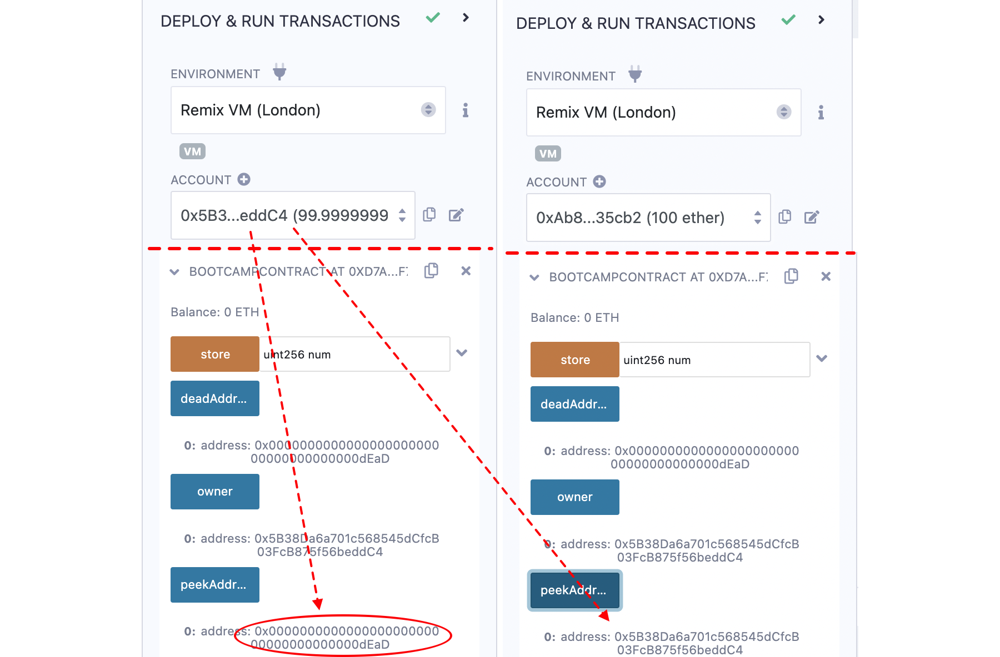

# Session 3, Project-ETHDenver-bootcamp
20 October 2022
# Zoom session

* 147 attendants
* Solidity, example in Remix: modifier, constructor, event (define, emit, explore log in Remix)
* Solidity, data structures: mapping, array, struct
* The zoom recording of 19th October: https://www.youtube.com/watch?v=n5tA0iC2e7I.

# Homework
## Assignment

To the contract of previous session, 

1.	Add a variable to hold the address of the deployer of the contract
2.	Update that variable with the deployer's address when the contract is deployed.
3.	Write an external function to return
* Address `0x000000000000000000000000000000000000dEaD` if called by the deployer
* The deployer's address otherwise

## Solution
_**Add a variable to hold the address of the deployer of the contract, update that variable with the deployer's address when the contract is deployed.**_

_**Write an external function to return address `0x000000000000000000000000000000000000dEaD` if called by the deployer, otherwise the deployer's address**_

