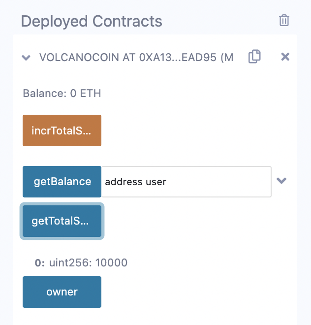

# Session 4, Project-ETHDenver-bootcamp
20 October 2022
# Zoom session

* 137 attendants, Solidity theory
* Inheritance, Internal functions,
*  Variable types bytes, string. Operator string compare, string concat, bytes concat
*  Variable types enum, constant, immutable
*  Keywords: require, assert, revert
*  Blocks try, catch. Keyword error (Solidity 0.8.4) to define error types for lisibility
*  How to import code from github and npm into Remix. Also imported from Hardhat is logging to console

* The zoom recording of 20th October: https://youtu.be/u0HPyGODIg4
* Session 4 useful links: https://github.com/fravoll/solidity-patterns

# Homework
## Assignment: VolcanoCoin contract
At each point where you change your contract you should re deploy to the JavascriptVM
and test your changes.
1. In Remix, create a new file called `VolcanoCoin.sol`.
2. Define the pragma compiler version to `^0.8.0`.
3. Before the pragma version, add a license identifer  `// SPDX-License-Identifier: UNLICENSED`
4. Create a contract called `VolcanoCoin`.
5. Create a variable to hold the total supply of 10000.
6. Make a public function that returns the total supply.
7. Make a public function that can increase the total supply. Inside the function, add 1000
to the current total supply.
8. We probably want users to be aware of functions in the contract for greater
transparency, but to make them all public will create some security risks (e.g. we don't
want users to be able to change the total supply).
Declare an address variable called `owner`
9. Next, create a `modifier` which only allows an owner to execute certain functions.
10. Make your change total supply function `public`, but add your modifier so that only
the owner can execute it.
11. The contract owner's address should only be updatable in one place. Create a
`constructor` and within the constructor, store the owner's address.
12. It would be useful to broadcast a change in the total supply. Create an `event` that emits
the new value whenever the total supply changes. When the supply changes, emit this
event
13. In order to keep track of user balances, we need to associate a user's address with the
balance that they have.
    * What is the best data structure to hold this association?
    * Using your choice of data structure, set up a variable called `balances` to keep
track of the number of volcano coins that a user has.
14. We want to allow the `balances` variable to be read from the contract, there are 2 ways
to do this.
    * What are those ways?
- Use one of the ways to make your `balances` variable visible to users of the contract.
15. Now change the constructor, to give all of the total supply to the owner of the
contract.
16. Now add a public function called `transfer` to allow a user to transfer their tokens to
another address. This function should have 2 parameters :
* the amount to transfer and
* the recipient address.
    * Why do we not need the sender's address here ?
    * What would be the implication of having the sender's address as a parameter ?
17. Add an event to the `transfer` function to indicate that a transfer has taken place, it
should log the amount and the recipient address.
18. We want to keep a record for each user's transfers. Create a `struct` called `Payment`
that stores the transfer amount and the recipient's address
19. We want to have a payments array for each user sending the payment. Create a
`mapping` which returns an array of Payment structs when given this user's address.
Resources
Official Solidity Documentation: https://docs.soliditylang.org/en/latest/
Globally Available Variables: https://docs.soliditylang.org/en/v0.8.6/units-and-global-variables.html


## Solution
_**In Remix, create a new file. Define the pragma compiler version. Before the pragma version, add a license identifer . Create a contract called VolcanoCoin. Create a variable to hold the total supply of 10000. Make a public function that returns the total supply. Make a public function that can increase the total supply. Inside the function, add 1000 to the current total supply.**_



_**Write an external function to return address `0x000000000000000000000000000000000000dEaD` if called by the deployer, otherwise the deployer's address**_


_**It would be useful to broadcast a change in the total supply. Create an `event` that emits the new value whenever the total supply changes. When the supply changes, emit this event**_
Code at this stage
  ```
// SPDX-License-Identifier: UNLICENSED
pragma solidity ^0.8.0;

contract VolcanoCoin {
    uint256 totalSupply = 10000;
    address public owner;
    address public user;
    event totalSupplyChanged(string, uint256);

    modifier onlyOwner() {
        if(msg.sender == owner) {
            _;
        }
    }

    constructor() {
        owner = msg.sender;
    }

    function getTotalSupply() public view returns(uint256){
        return totalSupply;
    }

    function setUser() public {
        user = msg.sender;
    }

    function incrTotalSupply() public onlyOwner{
        totalSupply += 1000;
        emit totalSupplyChanged("new totalSupply =", totalSupply);
    }
}
  ```

  TO BE CONTINUED

### Code
  ```
// SPDX-License-Identifier: None
pragma solidity 0.8.17;

contract VolcanoCoin {
    ...
    ...
}
  ```
