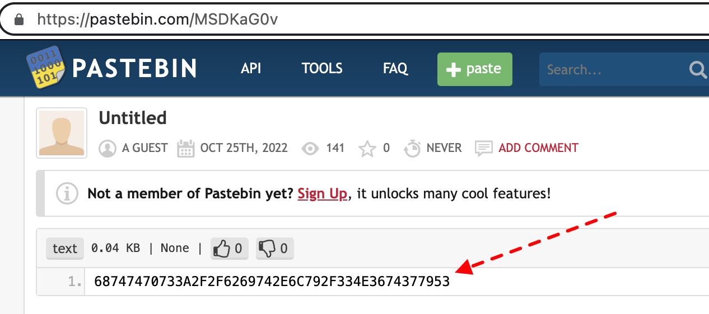

# Session 6, Project-ETHDenver-bootcamp
25 October 2022
# Zoom session

* 131 attendants,
* The zoom recording of 25th October: https://youtu.be/DbwziFc9b0U
* Session 6 useful links:


# Homework
## Assignment: Team Treasure Hunt
**Part 1**
To prepare for the treasure hunt you need to deploy a contract on Goerli test net.
1.	Take the contract and interface from this gist: https://gist.github.com/letsgitcracking/239306ea9f08d7e270f9d7e5245bdd2b
2.	Deploy the contract to Goerli test net and note the address it was deployed to. Address as deployed by the team: 0x555825393E6100aE07D4d6310Cb7605D6aF090A2

**Part 2**
Register your team name, team number with your team wallet here (site is locked after the game ends): https://gist.github.com/letsgitcracking/239306ea9f08d7e270f9d7e5245bdd2b
Look for clues in the transaction. Team's transaction hash: 0x6d22c5bcb382275bf0f9f8aa87c776c74430d9cc13a56be98b1e5023b0cd79df

This site may help you: https://www.rapidtables.com/convert/number/.

**Part 3**
The treasure contract looks like this: https://gist.github.com/letsgitcracking/a7d3d62df2d4a13f6b1cf9991da795d9.

Once you have found it on the test net, you need to
1. Call it from your interface contract with your team wallet
2. If successful - you should see the event in TreasureChest.sol

## Solution
- Take the source code from the gist in the link above in the assignment, part 1.
- Open Remix web page. In the File Explorer, folder `contracts`, create a file named `TreasureInterface.sol`. Copy-paste the snippet of code. Compile it if you didn't activate Remix auto-compile.
- In the `Deploy & run transactions` > `Environment`, choose `Injected Provider - Metamask`.
- In the Metamask popup, accept the connection, select the network Goerli, check that you have some test ETH. Click on "Deploy". Note the address.
(*Address as deployed by the team 5: `0x555825393E6100aE07D4d6310Cb7605D6aF090A2`*).


- Copy the address, go to the Extropy registration page (see part 2 of the assignment above) with the Metamask wallet connected, paste the address and register.
- In Metamask, in tab "Activity", click on the transaction to open the Etherscan web page with the contract's data and your transaction as the latest one of the contract. *Team 5's transaction hash: 0x6d22c5bcb382275bf0f9f8aa87c776c74430d9cc13a56be98b1e5023b0cd79df*. See the Goerli Etherscan sample on the YouTube of the solution: https://youtu.be/y3usfkKXZ44?t=102.
- Scroll down to the very first transaction of that contract. The second transaction in time, one line up, was called by the function `SendMessage`. 

- Click on it to see the details of the contract. Scroll down. The first clue is in the last field (field "Input Data"). Right-click on the button "View Input As" and select "UTF-8".

- It will show you a `bit.ly` link: https://bit.ly/3eZ9oVm. Open the link in your browser 

- Copy the Hex value (68747470733A2F2F6269742E6C792F334E3674377953).

- Convert the hex value into ASCII, for example using the web site in the assignment, part 2: https://www.rapidtables.com/convert/number/. Correct the typo to have the correct link https://bit.ly/3N6t7yS and open it.

- The link is to a Twitter message. Copy the content, representing a binary number(1110011101010000000100111000101001011101011011010010110000110111100000101111110101010010000101100001101111101100101111110001110111000100011110101111101111110000100110100011100110001010000001100001111111010010010000100100001100110000101010101010110101011001) and convert it to hex: E750138A5D6D2C3782FD52161BECBF1DC47AFBF09A398A061FD2424330AAAD59.


- Add 0x before the string and go to Goerli Etherscan. Search for this hash, 0xE750138A5D6D2C3782FD52161BECBF1DC47AFBF09A398A061FD2424330AAAD59. Choose "Click to see more". Scroll down to the field "Input Data". Click on "View Input As" UTF-8.

- Right-click on the link to open.

- We are almost there. Let's "inspect" the element in the browser page, with Command-Shift-C on macOS. (https://www.freecodecamp.org/news/how-to-inspect-an-element-chrome-shortcut/). We see another `bit.ly` link as a HTML comment (https://bit.ly/3ze0V7s).

- Open the link. It's another tweet, 0x18acF9DEB7F9535F4848a286b68C729AAc55697a. Again search it back in the Goerli Etherscan

- We are at the TreasureChest contract. Copy the address, Open the Remix where you deployed the initial gist interface and call the function getTreasure with this address. 

- This function will emit an event, that the game organizers can check that you've claimed the treasure.
```
emit TreasureClaimed(msg.sender, block.timestamp, "Well done!!");
``` 

## Full code
### Full Code of the gist, `ITreasureChest` interface
```
// SPDX-License-Identifier: UNLICENSED
pragma solidity 0.8.17;

interface ITreasureChest {
    function GetTreasure(address) external;
}

contract ClaimTreasure {

	function callTreasureContract(address _address) external {
		ITreasureChest(_address).GetTreasure(msg.sender);
	}
}
```
### Full Code of the `TreasureChest` contract
```
// SPDX-License-Identifier: UNLICENSED
pragma solidity 0.8.17;

/* 
Congratulations you have found the Treasure Chest contract.
You now need to make an interface contract to interact with the 
getTreasure method in this contract. Please look at the gist given 
during lesson for an example of an interface.
*/

interface ITeamRegistration {
	function registeredList(address) external view returns (bool);
}

contract TreasureChest {

    address immutable _owner;
    address TeamRegistrationContract;

	event InterfaceAddressedSet();
    event TreasureClaimed(address indexed, uint256 indexed, string indexed);
    
    modifier onlyAdmin() {
		require(msg.sender == _owner, "Not owner");
		_;
	}
    constructor() {
        _owner = msg.sender;
    }

    function setInterfaceAddress(address _address) external onlyAdmin {
        TeamRegistrationContract = _address;
		emit InterfaceAddressedSet();
    }

    function GetTreasure(address sender) external {
		require(ITeamRegistration(TeamRegistrationContract).registeredList(sender), "EOA is not registered!");
        emit TreasureClaimed(msg.sender, block.timestamp, "Well done!!");
    }
}
```
