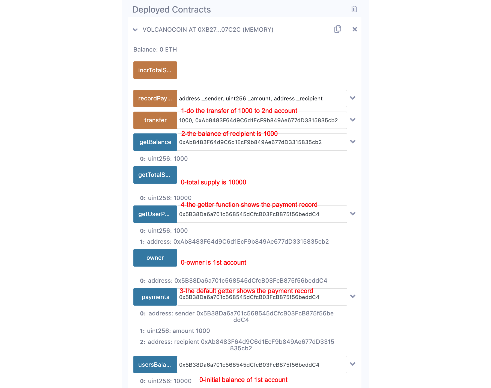

# Session 7, Project-ETHDenver-bootcamp
26 October 2022
# Zoom session
* 129 attendants, Blockchain security
  * explanation of the solution to the team game the day before
  * explanation of the Poly Network exploit in August 2021
  * best practices to avoid exploits
* The zoom recording of 26th October: 
* Session 7 useful links:
    - https://www.youtube.com/watch?v=b82SM3t8kxM: YouTube explanation of the Poly Network exploit
    - https://rekt.news/fr/: blog analyzing recent exploits, to learn from past errors . When we change language each one has a distinct list of exploits and their explanations.
    - https://secureum.substack.com/p/security-pitfalls-and-best-practices-101: security best practices
    - https://github.com/PatrickAlphaC/smartcon-hacker-house-hunt-rules: this game has 20 contracts deployed on Görli (E1… E7, M1… M8, H1… H5) that we can see on Etherscan. The game is to hack each of them to mint and own a NFT (minting more than 1 NFT per contract counts only as 1)
    - https://ethernaut.openzeppelin.com/: game is 27 contracts from Open Zeppelin that thee player must exploit
    - https://github.com/crytic/blockchain-security-contacts: list of contacts for white hats to report security issues to teams of the most famous contracts


# Homework
## Assignment: Adding more functionality to the Volcano Coin contract
1. We made a payment mapping, but we haven't added all the functionality for it yet. Write a function to view the payment records, specifying the user as an input. What is the difference between doing this and making the mapping public?
2. For the payments record mapping, create a function called recordPayment that takes
    - the sender's address,
    - the receiver's address and
    - the amount

as an input, then creates a new payment record and adds the new record to the user's payment record.

3. Each time we make a transfer of tokens, we should call this recordPayment function to record the transfer.


## Solution
1.	*We made a payments mapping, but we haven't added all the functionality for it yet. Write a function to view the payment records, specifying the user as an input. What is the difference between doing this and making the mapping public?*
- Making the mapping public and retrieving it with the construct payments.address will return all scalars of the struct but will not enumerate the arrays or mappings of the struct. We have to write a specific getter function to have exactly what is desired.
```
function getUserPayment(address _user) view public returns(uint256, address){
    require(_user != address(0x00), "this user has null address");
    return (payments[_user].amount, payments[_user].recipient);
}

```
2.	*For the payments record mapping, create a function called recordPayment that takes {the sender's address, the receiver's address and the amount} as an input, then creates a new payment record and adds the new record to the user's payment record*.
- The Payment struct is now
```
struct Payment{
    address sender;
    uint256 amount;
    address recipient;
}
mapping(address => Payment) public payments;    // cheat: not yet an array. Only last payment is recorded

```
- ***Cheat warning***: the current implementation does not yet use an array. Only last payment is recorded. To create an array of payments for each user, see https://docs.soliditylang.org/en/v0.4.21/types.html#arrays.

- The function `recordLastPayment` is
```
function recordLastPayment(uint256 _amount, address _recipient) public{
    // record the payment in the struct Payment of the payments mapping
    console.log("sender: ", msg.sender);
    payments[msg.sender].sender = msg.sender;
    payments[msg.sender].amount = _amount;
    payments[msg.sender].recipient = _recipient;
}
```
-	The transfer function is now
```
function transfer(uint256 _amount, address _recipient) public {
    // update the payments mapping, transfer coins, emit event
    require(usersBalances[msg.sender] >= _amount, "not enough balance to transfer");
    require(_recipient != address(0x00), "no transfer to a recipent with null address");
    // record the payment by updating the payments mapping
    recordLastPayment(_amount, _recipient);
    // do the transfer
    usersBalances[msg.sender] -= _amount;
    usersBalances[_recipient] += _amount;
    emit amountTransferred(_amount, " to ", _recipient);
}
```
## Full Code and result

```
// SPDX-License-Identifier: UNLICENSED
pragma solidity ^0.8.0;
import "hardhat/console.sol";                       // use hardhat to send message to console

contract VolcanoCoin {
    uint256 totalSupply = 10000;                    // initial supply of Volcano coins
    address public owner;                           // deployer of the contract
    mapping(address => uint256) public usersBalances;  // keep track of amount of coins of each user
    event totalSupplyChanged(string, uint256);
    event amountTransferred(uint256, string, address);
    struct Payment{
        address sender;
        uint256 amount;
        address recipient;
    }
    mapping(address => Payment) public payments;        // cheat: not yet an array. Only last payment is recorded

    modifier onlyOwner() {
        if(msg.sender == owner) {
            _;
        }
    }

    constructor() {
        owner = msg.sender;
        usersBalances[owner] = totalSupply;     // give owner all Volcano coins
    }

    function getTotalSupply() public view returns(uint256){
        // view number of Volcano coins
        return totalSupply;
    }

    function getBalance(address user) public view returns(uint256) {
        // view the balance of a given user
        return usersBalances[user];
    }

    function recordLastPayment(uint256 _amount, address _recipient) public{
        // record the payment in the struct Payment of the payments mapping
        console.log("sender: ", msg.sender);
        payments[msg.sender].sender = msg.sender;
        payments[msg.sender].amount = _amount;
        payments[msg.sender].recipient = _recipient;
    }

    function transfer(uint256 _amount, address _recipient) public {
        // update the payments mapping, transfer coins, emit event
        require(usersBalances[msg.sender] >= _amount, "not enough balance to transfer");
        require(_recipient != address(0x00), "no transfer to a recipent with null address");
        // record the payment by updating the payments mapping
        recordLastPayment(_amount, _recipient);
        // do the transfer
        usersBalances[msg.sender] -= _amount;
        usersBalances[_recipient] += _amount;
        emit amountTransferred(_amount, " to ", _recipient);
    }

    function getUserPayment(address _user) view public returns(uint256, address){
        // get the latest payment of an user
        require(_user != address(0x00), "this user has null address");
        return (payments[_user].amount, payments[_user].recipient);
    }
}
```
