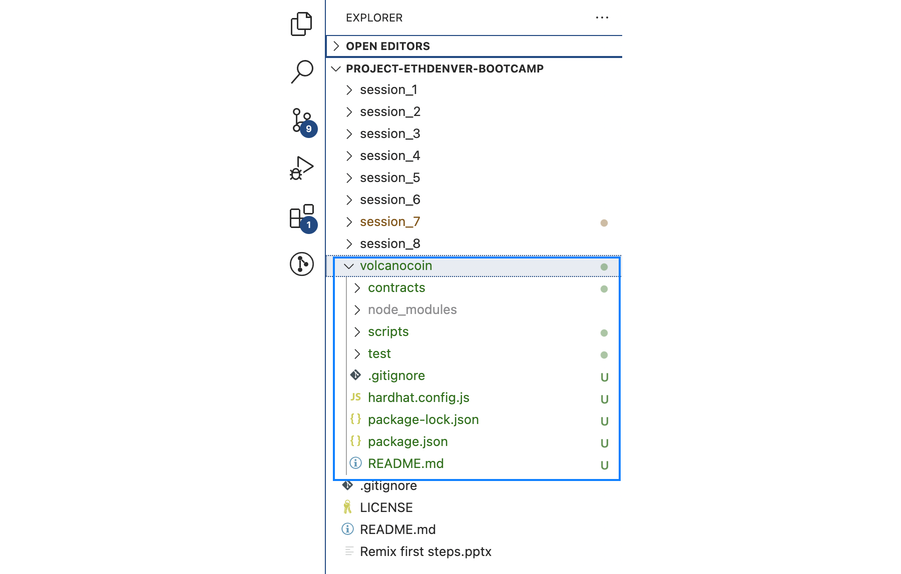

# Session 8, Project-ETHDenver-bootcamp
27 October 2022
# Zoom session
* 123 attendants, DAO exploit
  * solution to the homework
  * contract deployment tools: Remix, Hardhat, Foundry, Truffle and others
* The zoom recording of 26th October: https://youtu.be/1wxf7xgUuj8
* Session 8 useful links:
    - •	https://github.com/wighawag/hardhat-deploy: script engine to automate Hardhat deployment steps
    - https://book.getfoundry.sh/: Foundry documentation homepage

# Homework
## Assignment: Deploy & test VolcanoCoin
Using your choice of Hardhat, Foundry or Truffle
1. Create a project for your Volcano coin
2. Write unit tests for your Volcano coin contract

The tests should show that
1. The total supply is initially 10000
2. That the total supply can be increased in 1000 token steps
3. Only the owner of the contract can increase the supply.

For help with the syntax for unit tests see
- Hardhat:https://hardhat.org/guides/waffle-testing.html
- Foundry : https://book.getfoundry.sh/forge/tests
- Truffle: https://trufflesuite.com/docs/truffle/testing/writing-tests-in-javascript.html

You can use the gitpod workspace (not populated by Encode yet):
- https://github.com/ExtropyIO/SolidityBootcamp


## Solution using Hardhat - Create a project for your Volcano coin
### Install Hardhat
I check my versions of nodeJS and npm.
```sh
kvutien@MBP21VTK ~ % node --version
v16.15.1
kvutien@MBP21VTK ~ % npm --version
8.11.0
```
I install Hardhat locally inside the folder *Project-ETHDenver-bootcamp* managed by git. For this doing, I create the folder, I move to it, I install a `npm` environment and I install Hardhat in this `npm`:
```sh
kvutien@MBP21VTK ~ % cd /Users/kvutien/develop/hackhathons/ETHDenver_2022\ bootcamp/Bootcamp_repo/Project-ETHDenver-bootcamp
kvutien@MBP21VTK Project-ETHDenver-bootcamp % mkdir volcanocoin && cd volcanocoin
kvutien@MBP21VTK volcanocoin % npm init --yes
kvutien@MBP21VTK volcanocoin % npm install --save-dev hardhat
```
I create a default Hardhat project (I hit "enter" to all questions): 
```sh
kvutien@MBP21VTK volcanocoin % npx hardhat
```
VScode shows us the current folder content:


Because we installed Hardhat specifically today, the latest Solidity compiler is in the `hardhat.config.js`
```js
require("@nomicfoundation/hardhat-toolbox");

/** @type import('hardhat/config').HardhatUserConfig */
module.exports = {
  solidity: "0.8.17",
};
```
### Create the smart contract code and compile
The folder of the Hardhat project has by default a `contracts` folder with a sample Solidity program `Lock.sol` that we will replace by our tutorial program `VolcanoCoin.sol`. Copy-paste the code we had from Remix in the browser.

**Note:** You may see a VSCode red wiggle on the instruction import `hardhat/console.sol`; and a tooltip box saying "Source "*hardhat/console.sol" not found: File import callback not supported*". As we'll see below, Hardhat compiles it perfectly.

To compile the contract run `npx hardhat compile` in your terminal. The compile task is one of the Hardhat built-in tasks.
```sh
kvutien@MBP21VTK volcanocoin% npx hardhat compile
Downloading compiler 0.8.17
Compiled 3 Solidity files successfully
```
## Solution using Hardhat - Create VolcanoCoin test script
*Write unit tests for your Volcano coin contract. The tests should show that:*
1.	*The total supply is initially 10000*
2.	*That the total supply can be increased in 1000 token steps*
3.	*Only the owner of the contract can increase the supply.*

For this we're going to use `hardhat-network-helper` to interact with Hardhat Network, a local Ethereum blockchain network designed for development that is built-in and the default network in Hardhat. You don't need to setup anything to use it. In our tests we're going to use `ethers.js` to interact with the Ethereum contract we built in the previous section, and Mocha as our test runner.

Our Hardhat project has also by default a `test` folder with a test program `Lock.js` that we see later. Let's create our test program `Volcanocoin-test.js`.

Let's start with the code below. We'll explain it next, but for now paste this into `Volcanocoin-test.js`:
```js
// Hardhat test script of VolcanoCoin contract, Oct 2022
// ETHDenver Solidity Bootcamp - Vu Tien Khang, Machu Picchu

const { loadFixture } = require("@nomicfoundation/hardhat-network-helpers");
const { expect } = require("chai");

describe("Test VolcanoCoin contract", function () {

  /* We define a fixture to reuse the same setup in every test.
     We use loadFixture to run this setup once, snapshot that state,
     and reset Hardhat Network blockchain to that snapshot in every test.
     -volcanoCoin:  address of the deployed contract VolcanoCoin
     -owner:        private key of the deployer account
     -otherAccount  private key of a test account
  */
  async function deployVolcanoCoinFixture (){
    // Contracts are deployed using the first signer/account by default
    const [owner, otherAccount] = await ethers.getSigners();
    // Obtain the descriptor (ABI etc.) of the VolcanoCoin contract
    const VolcanoCoin = await ethers.getContractFactory("VolcanoCoin");
    const volcanoCoin = await VolcanoCoin.deploy();
    // return contract address and private key of other account than owner
    return {volcanoCoin, owner, otherAccount};
  }

  // Tests starts here
  describe("Initial supply of Volcano coins", function(){
  // test that initial supply is 10000
    it("Should have 10000 as initial supply", async function(){
      const {volcanoCoin} = await loadFixture(deployVolcanoCoinFixture);
      expect(await volcanoCoin.totalSupply()).to.equal(10000);
    });
  });

  describe("Increment initial supply of Volcano coins", function(){
    // test that total supply can be incremented by steps of 1000
    it("should increment oldValue by 1000 for newValue", async function(){
      const {volcanoCoin} = await loadFixture(deployVolcanoCoinFixture);
      // ethers.js returns a BigNumber that needs to be casted to a number
      value = Number(await volcanoCoin.totalSupply());
      value += 1000;
      volcanoCoin.incrTotalSupply();
      expect(Number(await volcanoCoin.totalSupply())).to.equal(value);
    });

  // test that the "require" condition reverts the transaction
    it("should fail if other account increments total supply", async function(){
      const {volcanoCoin, owner, otherAccount} = await loadFixture(deployVolcanoCoinFixture);
      // change signer of transaction to otherAccount by connect(otherAccount)
      expect(volcanoCoin.connect(otherAccount).incrTotalSupply()).to.be.revertedWith(
        "only owner can change total supply"
        );
    });
  });
});
```
To run the test, on your terminal run `npx hardhat test`. You should see the following output:
```sh
kvutien@MBP21VTK volcanocoin % npx hardhat test
  Test VolcanoCoin contract
    Initial supply of Volcano coins
      ✔ Should have 10000 as initial supply (784ms)
    Increment initial supply of Volcano coins
      ✔ should increment oldValue by 1000 for newValue (39ms)
      ✔ should fail if other account increments total supply

  3 passing (826ms)
```

## Detailed Explanation of Code 

###	Testing the tests
Note that the code below includes liberally console.log to check the values. The purpose is to test the test.js code. This avoids that an error in the test function declares valid a bad logic in the smart contract.
### The fixture to deploy VolcanoCoin
This preparation step is called to set up the environment of each test.
```js
const [owner, otherAccount] = await ethers.getSigners();
```
Hardhat has embedded a library `ethers.js` to make JavaScript calls to the local blockchain *Hardhat Network*. The documentation is at https://docs.ethers.io/v5/. Here we call the property `getSigners` that returns an array of private keys of all 10 accounts generated by Hardhat for tests (like ganache and like Remix). We keep only the first 2 keys. By default, the first account is the one that is used to deploy the contract (the `owner`).
```js
const VolcanoCoin = await ethers.getContractFactory("VolcanoCoin");
```
Here we invoke the function `getContractFactory()` with the name of the contract. It returns a JSON with the metadata generated when compiling the contract. This JSON is assigned to the `const VolcanoCoin`
```js
const volcanoCoin = await VolcanoCoin.deploy();
```
Here we use the `deploy()` function of the JSON `VolcanoCoin`. It returns the JSON of the contract that we store in `const volcanoCoin` (lower case), as well as the JSON of the `owner` and the `otherAccount`. 
```js
return {volcanoCoin, owner, otherAccount};
```
Once the contract is deployed, the fixture is done and returns the variables we need for the tests. Note that we return using an object (in curved brackets) instead of an array (in square brackets) because the returned values have different types.

### The first group of tests
Each group of tests is enclosed in a block of code materialized by the function `describe`. Each test is defined inside a block of code materialized by the function `it`. The arguments of `it` are a string that describes the test and a piece of executable code inside an anonymous function.

The first group of tests has only one test.
```js
const {volcanoCoin} = await loadFixture(deployVolcanoCoinFixture);
expect(await volcanoCoin.totalSupply()).to.equal(10000);
```
The first instruction sets up the test environment, the second instruction `expect()` checks the logical condition of the test. Note that we use `await` because both functions `loadFixture()` and `volcanoCoin.totalSupply()` are asynchronous.
### The second group of tests
The second group of tests has 2 tests: it checks that it is possible to increment the total supply of coins by 1000 at each call, then it checks that if someone else that the owner tries to increment to total supply, the transaction is reverted.
```js
value = Number(await volcanoCoin.totalSupply());
value += 1000;
```
Here we retrieve the initial total supply of coins as a `BigNumber`, we transform it into a normal JavaScript `Number`, we add 1000 and keep the result as reference, then we check that, after calling the function, the total amount of coins is equal to this reference. Note that we need to cast the type of the value that `volcanoCoin.totalSupply()` and `ethers.js` returned to something that the JavaScript test primitives of `chai` can handle; here it's `Number` because `ethers.js` returns a `BigNumber` representing the `uint256` of Solidity.
```js
expect(volcanoCoin.connect(otherAccount).incrTotalSupply()).to.be.revertedWith(
        "only owner can change total supply"

```
Here we use the `ethers.js` primitive `connect.otherAccount()` to change the account that calls the function `incrTotalSupply()`. Since only the `owner` can calls it, it should revert. This is the purpose of the test.


... ***That's all folks***